# Selenium Java Maven Framework

A comprehensive Selenium WebDriver test automation framework using Java, Maven, TestNG, and the Page Object Model (POM) pattern with SoftAssert implementation. The framework supports testing multiple websites with clear separation and organization.

## ✨ Key Highlights

- **187 comprehensive tests** across 2 websites (Rahul Shetty Academy & SauceDemo)
- **Multi-website architecture** with separate page objects, tests, and utilities per website
- **Page Object Model** with abstract BasePage and reusable Wait utility
- **SoftAssert pattern** for comprehensive test failure reporting
- **Explicit waits & FluentWait** for reliable, intelligent waiting
- **TestNG integration** with smoke, functional, and regression test groups
- **Allure Reports** for beautiful HTML test reporting with screenshots
- **Website-specific organization** for easy maintenance and scalability

---

## 📑 Table of Contents

### 🏗️ Framework & Architecture
- [Framework Architecture](#️-framework-architecture)
  - [Page Object Model (POM)](#page-object-model-pom)
  - [BasePage Class - The Foundation](#basepage-class---the-foundation)
  - [Wait Utility Class](#wait-utility-class---centralized-wait-management)
  - [Example Page Object](#example-page-object)
- [Test Framework Features](#-test-framework-features)
  - [SoftAssert Implementation](#softassert-implementation)
  - [FluentWait - Intelligent Waiting](#fluentwait---intelligent-waiting)

### 📂 Project Organization
- [Project Structure](#-project-structure)
- [Multi-Website Organization](#-multi-website-organization)
  - [Website-Specific Structure](#website-specific-structure)
  - [Benefits of This Organization](#benefits-of-this-organization)
  - [Adding a New Website](#adding-a-new-website)
- [Configuration](#-configuration)

### 🚀 Execution & Testing
- [Running Tests](#-running-tests)
  - [Run All Tests](#run-all-tests)
  - [Run Specific Test Suite](#run-specific-test-suite)
  - [Run Specific Test Class](#run-specific-test-class)

### 🧩 Test Examples & Documentation
- [Test Examples](#-test-examples)
  - [Radio Button Verification Best Practices](#radio-button-verification-best-practices)
  - [WebTableTest - Web Table Validation (20 Tests)](#webtabletest---web-table-validation-tests-20-tests--new)
  - [MouseHoverTest - Mouse Hover Interactions (20 Tests)](#mousehovertest---mouse-hover-interaction-tests-20-tests--new)
  - [LoginTest - SauceDemo Login Scenarios (26 Tests)](#logintest---saucedemo-login-scenarios-26-tests)
  - [InventoryPageTest - Inventory and Product Tests (20 Tests)](#inventorypagetest---inventory-and-product-tests-20-tests)
  - [SearchBarTest - Autocomplete/Suggestion Tests (7 Tests)](#searchbartest---autocompletesuggestion-tests-7-tests)
  - [DropdownTest - Dropdown Selection Tests (8 Tests)](#dropdowntest---dropdown-selection-tests-8-tests)
  - [CheckboxTest - Checkbox Interaction Tests (12 Tests)](#checkboxtest---checkbox-interaction-tests-12-tests)
  - [WindowSwitchTest - Window Handling Tests (10 Tests)](#windowswitchtest---window-handling-tests-10-tests)
  - [AlertTest - Alert and Confirm Box Tests (20 Tests)](#alerttest---alert-and-confirm-box-tests-20-tests--new)
  - [TabSwitchTest - Tab Switching Tests (12 Tests)](#tabswitchtest---tab-switching-tests-12-tests)

### 📊 Results & Reporting
- [Test Results](#-test-results)
  - [Test Breakdown by Website](#test-breakdown-by-website)
  - [Test Suite Organization](#test-suite-organization)
  - [Test Groups](#test-groups)
- [Technologies Used](#️-technologies-used)
- [Allure Reports](#-allure-reports)
  - [Quick Start](#quick-start)
  - [Installation](#installation)

### 🧠 Test Suite Mind Maps
- [Rahul Shetty Academy Test Suite Mind Map](#-rahul-shetty-academy-test-suite-mind-map)
  - [Test Structure Overview - 170 Tests](#test-structure-overview---170-tests-across-13-classes)
  - [Test Distribution by Category](#test-distribution-by-category)
  - [Test Classes Breakdown](#test-classes-breakdown)
  - [Test Priority Distribution](#test-priority-distribution)
  - [Test Coverage Matrix](#test-coverage-matrix)
  - [Allure Report Structure](#allure-report-structure)
  - [Key Testing Patterns](#key-testing-patterns)
  - [Test Execution Strategy](#test-execution-strategy)
  - [Common Test Scenarios](#common-test-scenarios)
  - [Test Maintenance Tips](#test-maintenance-tips)
- [SauceDemo Complete Test Suite Mind Map](#-saucedemo-complete-test-suite-mind-map)
  - [Test Structure Overview - All SauceDemo Tests (45 Tests)](#test-structure-overview---all-saucedemo-tests-45-tests)
  - [SauceDemo Test Distribution](#saucedemo-test-distribution)
  - [Test Categories Breakdown](#test-categories-breakdown)
  - [LoginTest Detailed Breakdown (25 Tests)](#logintest-detailed-breakdown-25-tests)
  - [InventoryPageTest Detailed Breakdown (20 Tests)](#inventorypagetest-detailed-breakdown-20-tests)
  - [Test Priority Distribution](#test-priority-distribution-1)
  - [SauceDemo Test Coverage Matrix](#saucedemo-test-coverage-matrix)
  - [Allure Report Structure for SauceDemo](#allure-report-structure-for-saucedemo)
  - [Key Testing Patterns in SauceDemo Suite](#key-testing-patterns-in-saucedemo-suite)
  - [Test Execution Strategy](#test-execution-strategy-1)
  - [Common Test Scenarios](#common-test-scenarios-1)
  - [Test Maintenance Tips](#test-maintenance-tips-1)
- [InventoryPageTest Mind Map](#-inventorypagetest-mind-map)
  - [Test Structure Overview](#test-structure-overview)
  - [Test Distribution by Category](#test-distribution-by-category-1)
  - [Test Priority Matrix](#test-priority-matrix)
  - [Test Execution Flow](#test-execution-flow)
  - [Test Groups & Suite Coverage](#test-groups--suite-coverage)
  - [Validation Techniques](#validation-techniques)
  - [Coverage Summary](#coverage-summary)
  - [Allure Report Integration](#allure-report-integration)
  - [Key Testing Insights](#key-testing-insights)

### 📚 Additional Information
- [Additional Resources](#-additional-resources)
- [Contributing](#-contributing)

---

## 🏗️ Framework Architecture

### Page Object Model (POM)

This framework implements the Page Object Model pattern with a robust base class structure:

#### **BasePage Class - The Foundation**

The `BasePage` is an **abstract class** that serves as the template for all page objects. Here's why each component is essential:

```java
public abstract class BasePage {
    protected WebDriver driver;
    protected Wait wait;

    public BasePage(WebDriver driver) {
        this.driver = driver;                   // 1️⃣
        this.wait = new Wait(driver);           // 2️⃣
        PageFactory.initElements(driver, this); // 3️⃣
        switchToDefaultContent();               // 4️⃣
    }
}
```

**Why Abstract?**
- ❌ Prevents direct instantiation (BasePage is a template, not a real page)
- ✅ Enforces inheritance - all page objects must extend it
- ✅ Centralizes common functionality
- ✅ Follows Template Method Pattern
- ✅ Ensures consistent structure across all page objects

**Constructor Breakdown:**

| Line | Purpose | Why It's Needed |
|------|---------|-----------------|
| **1️⃣ `this.driver = driver;`** | Stores WebDriver instance | Makes driver accessible to all methods in page classes |
| **2️⃣ `this.wait = new Wait(driver);`** | Creates Wait utility instance | Provides reusable explicit wait methods with 10-second default timeout |
| **3️⃣ `PageFactory.initElements(...)`** | Initializes all `@FindBy` elements | Connects WebElement annotations to actual DOM elements |
| **4️⃣ `switchToDefaultContent()`** | Resets to main frame | Ensures clean state, prevents iframe context issues |

**Benefits:**
- ✅ **DRY Principle** - Write initialization once, use everywhere
- ✅ **Consistency** - All pages have identical setup
- ✅ **Maintainability** - Change timeout/config in one place
- ✅ **Reliability** - Automatic frame reset prevents errors
- ✅ **Type Safety** - Polymorphism support for page objects

#### **Wait Utility Class - Centralized Wait Management**

The `Wait` class encapsulates all **explicit wait** and **FluentWait** functionality, promoting **separation of concerns** and **reusability**.

**What are Explicit Waits?**

Explicit waits are intelligent, targeted waits that poll for specific conditions before proceeding. Unlike implicit waits (which apply globally to all elements), explicit waits:
- ✅ Wait for specific conditions (visibility, clickability, presence)
- ✅ Apply to individual elements or scenarios
- ✅ Have configurable timeouts
- ✅ Provide clear exception messages when conditions aren't met
- ✅ Are more reliable than `Thread.sleep()` or implicit waits

**WebDriverWait vs FluentWait:**

| Feature | WebDriverWait | FluentWait |
|---------|--------------|------------|
| **Type** | Specialized implementation | Generic, flexible base class |
| **Polling Interval** | Fixed (500ms default) | Customizable |
| **Exception Handling** | Standard | Can ignore specific exceptions |
| **Use Case** | Common element waits | Advanced scenarios (page load, windows) |
| **Timeout** | Configurable | Configurable |

```java
public class Wait {
    private WebDriverWait wait;  // For standard explicit waits
    private WebDriver driver;    // For FluentWait scenarios

    public Wait(WebDriver driver) {
        this.driver = driver;
        this.wait = new WebDriverWait(driver, Duration.ofSeconds(10));
    }

    // Element Interaction Methods (with built-in explicit waits)
    public void clickElement(WebElement element) { ... }
    public void sendKeysToElement(WebElement element, String text) { ... }
    public void clearAndSendKeys(WebElement element, String text) { ... }

    // Element State Methods (with explicit wait verification)
    public boolean isElementDisplayed(WebElement element) { ... }
    public boolean isElementEnabled(WebElement element) { ... }
    public boolean isElementSelected(WebElement element) { ... }

    // Data Retrieval Methods (wait until element is visible)
    public String getElementText(WebElement element) { ... }
    public String getElementAttribute(WebElement element, String attribute) { ... }

    // Explicit Wait Methods (WebDriverWait-based)
    public void waitForElementToBeVisible(WebElement element) { ... }
    public void waitForElementToBeClickable(WebElement element) { ... }
    public void waitForFrameAndSwitch(String frameId) { ... }
    
    // FluentWait Methods - Advanced Polling for Complex Scenarios
    public void waitForPageLoad() { ... }
    public void waitForNumberOfWindows(int expectedWindows) { ... }
    public WebElement waitForElementToBeStable(WebElement element) { ... }
    public FluentWait<WebDriver> createFluentWait(long timeout, long polling) { ... }
}
```

**Wait Class Benefits:**
- ✅ **Explicit Waits** - Targeted, condition-based waiting (not global like implicit waits)
- ✅ **Single Responsibility** - Handles only wait logic
- ✅ **Reusability** - Can be used outside page objects if needed
- ✅ **Testability** - Easier to mock and unit test
- ✅ **Flexibility** - Supports custom timeout via constructor overload
- ✅ **Maintainability** - All wait logic centralized in one place
- ✅ **Error Handling** - Built-in exception handling for state checks
- ✅ **Intelligent Waiting** - FluentWait polls conditions instead of hard delays
- ✅ **Performance** - No wasted time waiting when conditions are already met
- ✅ **Clear Failures** - Timeout exceptions show expected condition vs actual state

#### **Example Page Object**

```java
public class HomePage extends BasePage {
    @FindBy(id = "alertbtn")
    private WebElement alertButton;
    
    @FindBy(css = "input[value='radio1']")
    private WebElement radio1Button;
    
    public HomePage(WebDriver driver) {
        super(driver); // Calls BasePage constructor
    }
    
    // Using Wait utility methods
    public void clickAlert() {
        clickElement(alertButton); // Inherited from BasePage
    }
    
    public void clickRadio1() {
        clickElement(radio1Button); // Wait utility handles explicit wait
    }
    
    public boolean isRadio1Selected() {
        return isElementSelected(radio1Button); // Inherited method
    }
}
```

**How It Works:**
1. Test creates page object: `HomePage homePage = new HomePage(driver);`
2. HomePage calls `super(driver)` → BasePage constructor executes
3. Driver stored, Wait utility initialized, PageFactory initializes @FindBy elements
4. Frame reset to default content
5. Page object ready to use with all elements initialized
6. Methods use inherited wait utilities (`clickElement`, `isElementSelected`, etc.)
7. Wait class handles all explicit waits transparently

---

## 🧪 Test Framework Features

### SoftAssert Implementation

All tests use **SoftAssert** instead of hard assertions:

```java
public class RadioButtonTest extends BaseTest {
    @Test
    public void testRadioButtons() {
        softAssert.assertTrue(condition1, "Message 1");
        softAssert.assertTrue(condition2, "Message 2");
        softAssert.assertTrue(condition3, "Message 3");
        softAssert.assertAll(); // Reports all failures at once
    }
}
```

**Benefits:**
- ✅ Tests continue execution after assertion failures
- ✅ Comprehensive failure reports showing all issues
- ✅ Better test coverage - validates all conditions
- ✅ Saves debugging time - see all failures in one run

### FluentWait - Intelligent Waiting

The framework uses **FluentWait** instead of `Thread.sleep()` for reliable, adaptive waiting:

```java
// Page Load Wait - Polls document.readyState until complete
waitForPageToLoad();

// Window Count Wait - Waits for expected number of windows
waitForNumberOfWindows(2);

// Element Stability - Handles stale elements during DOM updates
WebElement stableElement = wait.waitForElementToBeStable(element);
```

**FluentWait vs Thread.sleep:**

| Aspect | Thread.sleep() ❌ | FluentWait ✅ |
|--------|-------------------|---------------|
| **Speed** | Always waits full duration (e.g., 2000ms) | Returns immediately when condition met |
| **Reliability** | Fixed delay, may be too short or too long | Polls until condition met or timeout |
| **Adaptability** | Same on all systems | Adapts to system speed |
| **Resource Usage** | Blocks thread unnecessarily | Efficient polling with intervals |
| **Maintenance** | Hard-coded delays throughout code | Centralized wait logic |

**Example - Page Load Wait:**
```java
// Before: Hard-coded 2-second wait
Thread.sleep(2000); // Always waits 2 seconds, even if page loads in 200ms

// After: Intelligent wait
waitForPageToLoad(); // Returns as soon as document.readyState === "complete"
```

**Implementation Details:**
- **Default Timeout:** 10-30 seconds (configurable)
- **Polling Interval:** 500ms (checks condition twice per second)
- **Exception Handling:** Ignores transient exceptions (NoSuchElementException, StaleElementReferenceException)
- **Document Ready Check:** Uses JavascriptExecutor to poll `document.readyState`

**Benefits:**
- ✅ **Faster Test Execution** - No wasted waiting time
- ✅ **More Reliable** - Adapts to varying page load speeds
- ✅ **Self-Healing** - Handles timing issues automatically
- ✅ **Better Debugging** - Clear timeout exceptions with expected conditions
- ✅ **Cleaner Code** - No try-catch blocks for InterruptedException

---

## 📁 Project Structure

```
selenium-e2e/
├── src/
│   ├── main/
│   │   ├── java/com/framework/
│   │   │   ├── pages/
│   │   │   │   ├── BasePage.java                    # Abstract base for all pages
│   │   │   │   ├── rahulshetty/
│   │   │   │   │   ├── HomePage.java               # Rahul Shetty practice page
│   │   │   │   │   └── WebTablePage.java           # Web table page object
│   │   │   │   └── saucedemo/
│   │   │   │       ├── LoginPage.java              # SauceDemo login page
│   │   │   │       └── InventoryPage.java          # SauceDemo inventory page (enhanced with sort/cart)
│   │   │   └── utils/
│   │   │       ├── AllureListener.java      # Allure report listener
│   │   │       ├── ConfigReader.java        # Configuration management
│   │   │       ├── DriverManager.java       # WebDriver lifecycle
│   │   │       ├── LoggerUtil.java          # Logging utilities
│   │   │       ├── TestListener.java        # TestNG listeners
│   │   │       └── Wait.java                # Explicit wait utility class
│   │   └── resources/
│   │       ├── config/
│   │       │   └── config.properties        # Test configurations (3 base URLs)
│   │       └── logback.xml                  # Logging configuration
│   └── test/
│       ├── java/com/framework/
│       │   ├── tests/
│       │   │   ├── rahulshetty/             # 13 test classes - 170 tests total
│       │   │   │   ├── AlertTest.java              # Alert/confirm box tests (20 tests)
│       │   │   │   ├── CheckboxTest.java           # Checkbox tests (12 tests)
│       │   │   │   ├── DropdownTest.java           # Dropdown tests (8 tests)
│       │   │   │   ├── FixedHeaderTableTest.java   # Fixed header table tests (20 tests)
│       │   │   │   ├── HideShowTest.java           # Show/hide element tests (15 tests)
│       │   │   │   ├── HomePageTest.java           # Basic page tests (3 tests)
│       │   │   │   ├── IFrameTest.java             # iFrame tests (20 tests)
│       │   │   │   ├── MouseHoverTest.java         # Mouse hover tests (20 tests)
│       │   │   │   ├── RadioButtonTest.java        # Radio button tests (6 tests)
│       │   │   │   ├── SearchBarTest.java          # Autocomplete tests (7 tests)
│       │   │   │   ├── TabSwitchTest.java          # Tab switching tests (12 tests)
│       │   │   │   ├── WebTableTest.java           # Web table validation (17 tests)
│       │   │   │   └── WindowSwitchTest.java       # Window switching tests (10 tests)
│       │   │   └── saucedemo/               # 2 test classes - 46 tests total
│       │   │       ├── LoginTest.java              # Login scenarios (26 tests)
│       │   │       └── InventoryPageTest.java      # Inventory tests (20 tests: 4 display + 8 sort + 8 cart)
│       │   └── utils/
│       │       ├── AppTest.java                    # Sample test
│       │       ├── BaseTest.java                   # Test base class with SoftAssert
│       │       ├── TestConstants.java              # Shared test constants
│       │       ├── TestMessages.java               # Shared test messages
│       │       ├── rahulshetty/
│       │       │   ├── RahulShettyConstants.java   # Rahul Shetty test constants
│       │       │   └── RahulShettyMessages.java    # Rahul Shetty test messages (100+ constants)
│       │       └── saucedemo/
│       │           ├── SauceDemoConstants.java     # SauceDemo test constants (users, URLs, sort options)
│       │           └── SauceDemoMessages.java      # SauceDemo test messages (85+ constants)
│       └── resources/
│           ├── allure.properties            # Allure configuration
│           └── testng/
│               ├── testng.xml                      # Master suite (187 tests)
│               ├── rahulshetty/
│               │   ├── smoke-suite.xml             # Smoke tests
│               │   ├── functional-suite.xml        # Functional tests
│               │   └── regression-suite.xml        # Regression tests
│               └── saucedemo/
│                   ├── smoke-suite.xml             # SauceDemo smoke tests
│                   ├── functional-suite.xml        # SauceDemo functional tests
│                   ├── regression-suite.xml        # SauceDemo regression tests
│                   └── saucedemo-suite.xml         # All SauceDemo tests (46 tests)
├── .allure/                                        # Allure command-line tool
├── .github/workflows/                              # GitHub Actions (if configured)
├── ALLURE_REPORTS.md                               # Allure reporting guide
├── PRESENTATION.md                                 # Framework presentation
├── TEST_GROUPS.md                                  # Test groups documentation
├── USAGE_EXAMPLES.md                               # Usage examples
├── WEB_TABLE_VALIDATION_SUMMARY.md                 # Web table test documentation
└── pom.xml                                         # Maven dependencies and plugins
```

---

## 🚀 Running Tests

### Run All Tests
```bash
mvn clean test
```

### Run Specific Test Suite
```bash
# Master Suite (runs all tests)
mvn test -Dsurefire.suiteXmlFiles=src/test/resources/testng/testng.xml

# Rahul Shetty Academy Tests
mvn test -Dsurefire.suiteXmlFiles=src/test/resources/testng/rahulshetty/smoke-suite.xml        # 14+ critical tests
mvn test -Dsurefire.suiteXmlFiles=src/test/resources/testng/rahulshetty/functional-suite.xml   # 50+ detailed tests
mvn test -Dsurefire.suiteXmlFiles=src/test/resources/testng/rahulshetty/regression-suite.xml   # 60+ comprehensive tests

# SauceDemo Tests
mvn test -Dsurefire.suiteXmlFiles=src/test/resources/testng/saucedemo/saucedemo-suite.xml      # 30 tests (26 login + 4 inventory)
```

### Run Specific Test Class
```bash
# Rahul Shetty Academy Tests
mvn test -Dtest=MouseHoverTest    # 20 mouse hover tests
mvn test -Dtest=WebTableTest      # 20 web table validation tests
mvn test -Dtest=AlertTest         # 20 alert and confirm box tests
mvn test -Dtest=IFrameTest        # 20 iframe tests
mvn test -Dtest=TabSwitchTest     # 12 tab switching tests
mvn test -Dtest=WindowSwitchTest  # 10 window handling tests
mvn test -Dtest=CheckboxTest      # 12 checkbox tests
mvn test -Dtest=DropdownTest      # 8 dropdown tests
mvn test -Dtest=SearchBarTest     # 7 autocomplete tests
mvn test -Dtest=RadioButtonTest   # 6 radio button tests
mvn test -Dtest=HomePageTest      # 3 basic page tests

# SauceDemo Tests
mvn test -Dtest=LoginTest          # 26 comprehensive login scenario tests
mvn test -Dtest=InventoryPageTest  # 20 focused inventory page tests (display, sort, cart)
```

---

## 🏢 Multi-Website Organization

The framework is organized to support testing multiple websites with clear separation of concerns:

### Website-Specific Structure

#### Pages Organization
- **`pages/rahulshetty/`** - Page objects for Rahul Shetty Academy (HomePage, WebTablePage)
- **`pages/saucedemo/`** - Page objects for SauceDemo (LoginPage, InventoryPage)

#### Test Organization
- **`tests/rahulshetty/`** - 11 test classes with 141 tests for Rahul Shetty Academy
- **`tests/saucedemo/`** - 2 test classes with 46 tests for SauceDemo (LoginTest, InventoryPageTest)

#### Utility Classes
- **`utils/rahulshetty/`** - RahulShettyConstants, RahulShettyMessages
- **`utils/saucedemo/`** - SauceDemoConstants, SauceDemoMessages

#### TestNG Suites
- **`testng/rahulshetty/`** - smoke-suite, functional-suite, regression-suite
- **`testng/saucedemo/`** - saucedemo-suite

### Benefits of This Organization

✅ **Clear Separation** - Each website has its own namespace
✅ **Easy Maintenance** - Changes to one website don't affect others
✅ **Scalability** - Easy to add new websites following the same pattern
✅ **Reusability** - Shared utilities (Wait, DriverManager) used across all websites
✅ **Independent Testing** - Run tests for specific websites independently

### Adding a New Website

To add tests for a new website, follow this structure:

1. Create page objects in `pages/yourwebsite/`
2. Create test classes in `tests/yourwebsite/`
3. Create constants in `utils/yourwebsite/YourWebsiteConstants.java`
4. Create messages in `utils/yourwebsite/YourWebsiteMessages.java`
5. Create TestNG suite in `testng/yourwebsite/yourwebsite-suite.xml`
6. Add base URL to `config.properties`

---

## 📝 Configuration

The framework supports multiple base URLs configured in `config.properties`:

```properties
# Browser Configuration
browser=chrome
headless=false

# Application URLs - Access by index: baseUrl.0, baseUrl.1, etc.
baseUrl.0=https://testautomationpractice.blogspot.com
baseUrl.1=https://rahulshettyacademy.com/AutomationPractice
baseUrl.2=https://www.saucedemo.com
baseUrl.3=https://the-internet.herokuapp.com
```

**Usage in Tests:**
```java
driver.get(ConfigReader.getBaseUrl(1)); // Loads baseUrl.1
```

---

## 🧩 Test Examples

### Radio Button Verification Best Practices

The framework includes comprehensive radio button tests demonstrating:

1. **Visibility & State Verification**
   ```java
   softAssert.assertTrue(homePage.isRadio1Displayed(), "Radio1 should be displayed");
   softAssert.assertTrue(homePage.isRadio1Enabled(), "Radio1 should be enabled");
   ```

2. **Selection Verification**
   ```java
   homePage.clickRadio1();
   softAssert.assertTrue(homePage.isRadio1Selected(), "Radio1 should be selected");
   ```

3. **Mutual Exclusivity Testing**
   ```java
   homePage.clickRadio1();
   softAssert.assertTrue(homePage.isRadio1Selected());
   softAssert.assertFalse(homePage.isRadio2Selected());
   softAssert.assertFalse(homePage.isRadio3Selected());
   ```

4. **Switching Behavior**
   ```java
   homePage.clickRadio1();
   homePage.clickRadio2();
   softAssert.assertFalse(homePage.isRadio1Selected(), "Radio1 deselected");
   softAssert.assertTrue(homePage.isRadio2Selected(), "Radio2 selected");
   ```

---

### WebTableTest - Web Table Validation Tests (20 Tests) ⭐ NEW

Comprehensive test suite for validating web table structure, data extraction, and search functionality on Rahul Shetty Academy practice page:

#### Table Structure Tests (3 Tests)
1. **testTableIsDisplayed** - Verifies web table is visible on the page
2. **testTableHeaders** - Validates correct headers (Instructor, Course, Price)
3. **testTableDimensions** - Tests row and column count (3 columns, 10+ rows)

#### Data Validation Tests (3 Tests)
4. **testAllInstructorsAreRahulShetty** - Verifies all courses taught by Rahul Shetty
5. **testAllPricesAreNumeric** - Validates all price values are valid numbers
6. **testCompleteTableData** - Comprehensive validation of all table data

#### Course Search Tests (3 Tests)
7. **testSpecificCourseExists** - Tests searching for specific course (Selenium Java)
8. **testMultipleCoursesExist** - Validates presence of 10 expected courses
9. **testAllCoursesByInstructor** - Gets and validates all courses by instructor

#### Price Validation Tests (4 Tests)
10. **testSeleniumCoursePrice** - Verifies Selenium course price ($30)
11. **testMultipleCoursesPrices** - Tests 6 different course prices
12. **testFreeCourse** - Validates QA Resume course is free (price = 0)
13. **testCourseCountByInstructor** - Verifies Rahul Shetty has 10+ courses

#### Row Data Tests (2 Tests)
14. **testSpecificRowData** - Validates all data in first table row
15. **testColumnDataExtraction** - Tests extracting complete column data

#### Debug Tests (2 Tests)
16. **testDebugTableStructure** - Inspects HTML structure for troubleshooting
17. **testPrintAllCourses** - Prints all courses and prices to console

```java
// Verify table is displayed
boolean isDisplayed = webTablePage.isTableDisplayed();

// Get table headers
List<String> headers = webTablePage.getTableHeaders();
// Returns: ["Instructor", "Course", "Price"]

// Get row and column count
int rowCount = webTablePage.getRowCount();      // 10+
int columnCount = webTablePage.getColumnCount(); // 3

// Get all instructors
List<String> instructors = webTablePage.getAllInstructors();

// Check if course exists
boolean exists = webTablePage.isCoursePresent("Selenium Webdriver with Java...");

// Get price by course name
String price = webTablePage.getPriceByCourse("Learn SQL in Practical...");
// Returns: "25"

// Get all prices
List<String> prices = webTablePage.getAllPrices();

// Get courses by instructor
List<String> courses = webTablePage.getCoursesByInstructor("Rahul Shetty");

// Get specific row data
Map<String, String> rowData = webTablePage.getRowData(1);
// Returns: {"Instructor": "Rahul Shetty", "Course": "Selenium...", "Price": "30"}

// Get all table data
List<Map<String, String>> allData = webTablePage.getAllTableData();
```

**Key Features:**
- ✅ Page Object implementation (WebTablePage.java) with 215 lines of reusable logic
- ✅ Centralized test messages and course names in TestMessages class
- ✅ 31 assertion message constants for consistency
- ✅ 10 course name constants for reusability
- ✅ Tests all table operations: search, filter, extraction, validation
- ✅ Comprehensive data integrity checks
- ✅ Debug utilities for troubleshooting table issues
- ✅ Integration with Allure reporting (@Epic, @Feature, @Story)
- ✅ Detailed documentation in WEB_TABLE_VALIDATION_SUMMARY.md

**Benefits:**
- 🎯 Single source of truth for test data (messages and course names)
- 🔧 Easy maintenance when table structure changes
- 📊 Comprehensive test coverage for table operations
- 🧪 Reusable page object for future table tests
- 📝 Clear, descriptive test names and assertions

---

### MouseHoverTest - Mouse Hover Interaction Tests (20 Tests) ⭐ NEW

Comprehensive test suite for validating mouse hover functionality with dropdown menu interactions on Rahul Shetty Academy practice page:

#### Button State Tests (2 Tests - Smoke)
1. **testMouseHoverButtonDisplayed** - Verifies mouse hover button is visible on page
2. **testMouseHoverButtonEnabled** - Validates button is enabled and interactive

#### Link Visibility Tests (3 Tests)
3. **testTopLinkVisibleOnHover** - Tests "Top" link appears when hovering
4. **testReloadLinkVisibleOnHover** - Tests "Reload" link appears when hovering
5. **testBothLinksVisibleOnHover** - Validates both links visible simultaneously on hover

#### Link Text Validation Tests (2 Tests)
6. **testTopLinkText** - Verifies "Top" link has correct text
7. **testReloadLinkText** - Verifies "Reload" link has correct text

#### Link Attributes Tests (2 Tests)
8. **testTopLinkHasHref** - Validates Top link has href="#top"
9. **testReloadLinkHasHref** - Validates Reload link has href="#reload"

#### Clickability Tests (2 Tests)
10. **testTopLinkClickable** - Tests Top link is clickable when hovering
11. **testReloadLinkClickable** - Tests Reload link is clickable when hovering

#### Click Action Tests (2 Tests)
12. **testClickTopLink** - Verifies clicking Top link scrolls page to top
13. **testClickReloadLink** - Tests clicking Reload link refreshes page functionality

#### State Consistency Tests (4 Tests)
14. **testMultipleHovers** - Tests multiple consecutive hovers work correctly
15. **testHoverStateConsistent** - Validates hover state consistency across multiple hovers
16. **testLinksAppearInCorrectOrder** - Verifies links appear in expected order
17. **testClickTopAndHoverAgain** - Tests clicking Top and hovering again works

#### Additional Tests (3 Tests)
18. **testMouseHoverButtonText** - Validates button has correct text "Mouse Hover"
19. **testTopLinkDisplayedAfterHover** - Verifies Top link visibility after hover
20. **testReloadLinkDisplayedAfterHover** - Verifies Reload link visibility after hover

```java
// Scroll to Mouse Hover section
homePage.scrollToMouseHover();

// Check button state
boolean isDisplayed = homePage.isMouseHoverButtonDisplayed();
boolean isEnabled = homePage.isMouseHoverButtonEnabled();
String buttonText = homePage.getMouseHoverButtonText(); // "Mouse Hover"

// Hover over button to reveal links
homePage.hoverOverMouseHoverButton();

// Check link visibility
boolean topVisible = homePage.isTopLinkDisplayed();
boolean reloadVisible = homePage.isReloadLinkDisplayed();

// Get link text
String topText = homePage.getTopLinkText();       // "Top"
String reloadText = homePage.getReloadLinkText(); // "Reload"

// Get link attributes
String topHref = homePage.getTopLinkHref();       // "#top"
String reloadHref = homePage.getReloadLinkHref(); // "#reload"

// Check if links are clickable
boolean topClickable = homePage.isTopLinkClickable();
boolean reloadClickable = homePage.isReloadLinkClickable();

// Click links
homePage.clickTopLink();    // Scrolls to top of page
homePage.clickReloadLink(); // Reloads page
```

**Key Features:**
- ✅ Actions API integration for mouse hover interactions
- ✅ Centralized scroll logic in @BeforeMethod (eliminates 20 duplicate calls)
- ✅ 26 assertion message constants in TestMessages
- ✅ 3 test data constants in TestConstants (TOP_LINK_TEXT, RELOAD_LINK_TEXT, MOUSE_HOVER_BUTTON_TEXT)
- ✅ Comprehensive validation: visibility, text, href, clickability, and functionality
- ✅ State consistency tests for multiple hover interactions
- ✅ Integration with smoke and regression test suites
- ✅ Uses explicit waits for reliable hover interactions

**Benefits:**
- 🎯 Validates complex mouse hover interactions with dropdown menus
- 🔧 Reusable page object methods for hover functionality
- 📊 Comprehensive test coverage for hover states and link interactions
- 🧪 Tests both link visibility and actual click functionality
- 📝 Clear separation of smoke (2) and regression (18) tests

---

### LoginTest - SauceDemo Login Scenarios (26 Tests)

Comprehensive test suite for SauceDemo authentication covering valid/invalid credentials, edge cases, and security scenarios:

#### Login Page Element Tests (4 Tests - Smoke)
1. **testLoginPageLoads** - Verifies login page loads successfully
2. **testPageTitle** - Validates page title "Swag Labs"
3. **testLoginElementsEnabled** - Tests username/password fields and login button are enabled
4. **testLoginButtonText** - Verifies login button has correct text

#### Input Field Tests (4 Tests)
5. **testUsernameFieldAcceptsInput** - Tests username field accepts text input
6. **testPasswordFieldAcceptsInput** - Tests password field accepts text input
7. **testClearUsernameField** - Verifies username field can be cleared
8. **testClearPasswordField** - Verifies password field can be cleared

#### Valid Login Scenarios (6 Tests)
9. **testLoginWithStandardUser** - Tests successful login with standard_user
10. **testLoginWithLockedUser** - Validates locked_out_user shows error message
11. **testLoginWithProblemUser** - Tests problem_user login behavior
12. **testLoginWithPerformanceUser** - Tests performance_glitch_user login
13. **testLoginWithErrorUser** - Tests error_user login functionality
14. **testLoginWithVisualUser** - Tests visual_user login scenario

#### Invalid Credentials Tests (5 Tests)
15. **testLoginWithInvalidUsername** - Tests error message for invalid username
16. **testLoginWithInvalidPassword** - Tests error message for invalid password
17. **testLoginWithEmptyUsername** - Validates error when username is empty
18. **testLoginWithEmptyPassword** - Validates error when password is empty
19. **testLoginWithEmptyCredentials** - Tests error with both fields empty

#### Edge Case and Security Tests (6 Tests)
20. **testLoginWithSpecialCharactersUsername** - Tests special characters in username (@, #, !)
21. **testLoginWithSQLInjection** - Validates SQL injection protection (admin' OR '1'='1)
22. **testLoginWithWrongCase** - Tests case-sensitive password validation
23. **testLoginWithSpacesInUsername** - Tests username with leading/trailing spaces
24. **testMultipleFailedLoginAttempts** - Tests multiple consecutive failed logins
25. **testLoginAfterClearingInvalidCredentials** - Tests recovery after failed login

```java
// Test valid login
loginPage.enterUsername(SauceDemoConstants.STANDARD_USER);
loginPage.enterPassword(SauceDemoConstants.PASSWORD);
loginPage.clickLoginButton();
softAssert.assertTrue(inventoryPage.isInventoryPageDisplayed());

// Test invalid login
loginPage.enterUsername("invalid_user");
loginPage.enterPassword("wrong_password");
loginPage.clickLoginButton();
softAssert.assertTrue(loginPage.isErrorMessageDisplayed());
String errorMsg = loginPage.getErrorMessageText();
softAssert.assertEquals(errorMsg, "Epic sadface: Username and password do not match any user in this service");

// Test locked user
loginPage.login(SauceDemoConstants.LOCKED_OUT_USER, SauceDemoConstants.PASSWORD);
softAssert.assertTrue(loginPage.isErrorMessageDisplayed());
softAssert.assertTrue(loginPage.getErrorMessageText().contains("locked out"));

// Test edge cases - SQL injection
loginPage.enterUsername("admin' OR '1'='1");
loginPage.enterPassword(SauceDemoConstants.PASSWORD);
loginPage.clickLoginButton();
softAssert.assertTrue(loginPage.isErrorMessageDisplayed(), "SQL injection should be blocked");
```

**Key Features:**
- ✅ Page Object Model (LoginPage, InventoryPage)
- ✅ Tests all 6 user types (standard, locked, problem, performance, error, visual)
- ✅ Comprehensive error message validation
- ✅ Security testing (SQL injection, special characters)
- ✅ Edge case handling (empty fields, case sensitivity, spaces)
- ✅ Recovery testing after failed login attempts
- ✅ Centralized constants (SauceDemoConstants) and messages (SauceDemoMessages)
- ✅ Integration with TestNG groups (smoke, functional, regression)
- ✅ All tests use SoftAssert for comprehensive failure reporting

**Benefits:**
- 🎯 Comprehensive authentication testing covering all scenarios
- 🔒 Security validation against common attack vectors
- 🧪 Reusable page objects for future SauceDemo tests
- 📊 Clear test organization with 5 logical sections
- ✅ Validates both successful and failed login paths

---

### InventoryPageTest - Inventory and Product Tests (20 Tests)

Comprehensive test suite for SauceDemo inventory page covering display validation, sort/filter functionality, and shopping cart operations:

```java
// Login and navigate to inventory
loginPage.login(SauceDemoConstants.STANDARD_USER, SauceDemoConstants.PASSWORD);
softAssert.assertTrue(inventoryPage.isInventoryPageDisplayed());

// Verify inventory elements
softAssert.assertTrue(inventoryPage.isAppLogoDisplayed());
softAssert.assertTrue(inventoryPage.isSortDropdownDisplayed());
softAssert.assertTrue(inventoryPage.isShoppingCartDisplayed());

// Test sort functionality
inventoryPage.selectSortOption(SauceDemoConstants.SORT_NAME_ASC);
List<String> productNames = inventoryPage.getAllProductNames();
List<String> sortedNames = productNames.stream().sorted().toList();
softAssert.assertEquals(productNames, sortedNames, "Products should be sorted A to Z");

// Test shopping cart
inventoryPage.addItemToCart(0);
softAssert.assertTrue(inventoryPage.isCartBadgeDisplayed());
softAssert.assertEquals(inventoryPage.getCartBadgeCount(), "1");

// Verify cart persists after sorting
inventoryPage.selectSortOption(SauceDemoConstants.SORT_PRICE_LOW_HIGH);
softAssert.assertEquals(inventoryPage.getCartBadgeCount(), "1", "Cart count unchanged");
```

---

### SearchBarTest - Autocomplete/Suggestion Tests (7 Tests)

Comprehensive autocomplete functionality testing:

1. **testAutocompleteSuggestionsAppear** - Verifies suggestions display when typing
2. **testSelectSuggestionByText** - Tests selecting suggestion by exact text match
3. **testSelectSuggestionByIndex** - Tests selecting suggestion by position
4. **testAutocompleteWithFullCountryName** - Validates full text search
5. **testAutocompleteClearAndReenter** - Tests clearing and re-entering text
6. **testAutocompletePartialMatch** - Verifies partial text matching
7. **testAutocompleteCaseInsensitivity** - Tests case-insensitive search

```java
// Enter text and get suggestions
homePage.enterCountryInAutocomplete("Ind");
boolean hasSuggestions = homePage.isSuggestionListDisplayed();
int count = homePage.getSuggestionCount();

// Select by text match
homePage.selectSuggestionByText("India");

// Select by index
homePage.selectSuggestionByIndex(0);

// Get all suggestions
List<String> allSuggestions = homePage.getAllSuggestions();

// Verify selected value
String value = homePage.getAutocompleteValue();
```

---

### DropdownTest - Dropdown Selection Tests (8 Tests)

Validates dropdown selection functionality:

1. **testDropdownDisplayed** - Verifies dropdown is visible and enabled
2. **testSelectOption1** - Tests selecting "Option1" by visible text
3. **testSelectOption2** - Tests selecting "Option2" by visible text
4. **testSelectOption3** - Tests selecting "Option3" by visible text
5. **testDropdownHasAllOptions** - Verifies all expected options are present
6. **testSelectDropdownByIndex** - Tests selecting option by index position
7. **testSelectDropdownByValue** - Tests selecting option by value attribute
8. **testDefaultSelectOption** - Verifies default "Select" option state

```java
// Select by visible text
homePage.selectDropdownOption("Option1");

// Select by index
homePage.selectDropdownByIndex(2);

// Select by value
homePage.selectDropdownByValue("option2");

// Get selected option
String selected = homePage.getSelectedDropdownOption();

// Get all options
List<String> options = homePage.getAllDropdownOptions();
```

---

### CheckboxTest - Checkbox Interaction Tests (12 Tests)

Comprehensive checkbox testing covering all interaction patterns:

1. **testCheckboxesVisibilityAndState** - Verifies checkboxes are displayed and enabled
2. **testDefaultUncheckedState** - Validates default unchecked state
3. **testCheckCheckbox1/2/3** - Tests checking individual checkboxes
4. **testUncheckCheckbox1** - Tests unchecking functionality
5. **testMultipleCheckboxSelection** - Validates multiple selections
6. **testCheckboxToggleBehavior** - Tests toggle on/off behavior
7. **testIndependentCheckboxBehavior** - Verifies checkboxes work independently
8. **testSelectiveUnchecking** - Tests selective uncheck operations
9. **testSafeCheckMethods** - Validates idempotent check methods
10. **testSafeUncheckMethods** - Validates idempotent uncheck methods

```java
// Click to toggle
homePage.clickCheckbox1();

// Safe check (idempotent - won't uncheck if already checked)
homePage.checkCheckbox1();

// Safe uncheck (idempotent - won't check if already unchecked)
homePage.uncheckCheckbox1();

// Check state
boolean isSelected = homePage.isCheckbox1Selected();
boolean isDisplayed = homePage.isCheckbox1Displayed();
boolean isEnabled = homePage.isCheckbox1Enabled();
```

---

### WindowSwitchTest - Window Handling Tests (10 Tests)

Tests window switching and popup handling:

1. **testOpenWindowButtonVisibilityAndState** - Verifies button is displayed and enabled
2. **testOpenWindowButtonOpensNewWindow** - Tests opening new window
3. **testNewWindowOpensCorrectUrl** - Verifies new window URL (https://www.qaclickacademy.com/)
4. **testNewWindowTitle** - Validates new window has proper title
5. **testSwitchBackToParentWindow** - Tests switching back to parent window
6. **testParentWindowInteractiveAfterOpeningChild** - Verifies parent remains interactive
7. **testClosingChildWindowDoesNotAffectParent** - Tests parent unaffected when child closes
8. **testMultipleWindowOpening** - Validates button reuses same window on multiple clicks
9. **testWindowHandlesAreUnique** - Verifies window handles are unique
10. **testNewWindowHasExpectedContent** - Validates new window content

```java
// Click button to open new window
homePage.clickOpenWindowButton();

// Get window handles
String parentHandle = driver.getWindowHandle();
Set<String> allHandles = driver.getWindowHandles();

// Switch to child window
for (String handle : allHandles) {
    if (!handle.equals(parentHandle)) {
        driver.switchTo().window(handle);
        break;
    }
}

// Verify and close child window
String url = driver.getCurrentUrl();
driver.close();
driver.switchTo().window(parentHandle);
```

---

### AlertTest - Alert and Confirm Box Tests (20 Tests) ⭐ NEW

Comprehensive test suite for JavaScript alert and confirm box functionality with detailed message verification:

#### Alert Button Tests (8 Tests)
1. **testAlertButtonVisibilityAndState** - Verifies alert button is displayed and enabled
2. **testAlertWithEnteredName** - Tests alert popup with user-entered name
3. **testAlertMessageFormat** - Validates alert message format (starts with "Hello")
4. **testAlertWithEmptyName** - Tests alert displays even with empty name field
5. **testPageInteractiveAfterAlert** - Verifies page remains interactive after accepting alert
6. **testMultipleAlertTriggers** - Tests triggering alerts multiple times with different names
7. **testAlertWithSpecialCharacters** - Validates alert handles special characters (@, #, !)
8. **testAlertWithLongName** - Tests alert with very long name input

#### Confirm Box Tests (9 Tests)
9. **testConfirmButtonVisibilityAndState** - Verifies confirm button is displayed and enabled
10. **testConfirmBoxWithEnteredName** - Tests confirm box with user-entered name
11. **testConfirmBoxMessageFormat** - Validates confirm message format (starts with "Hello")
12. **testAcceptConfirmBox** - Tests accepting confirm box (OK button)
13. **testDismissConfirmBox** - Tests dismissing confirm box (Cancel button)
14. **testConfirmBoxWithEmptyName** - Tests confirm box displays even with empty name
15. **testPageInteractiveAfterConfirmBox** - Verifies page remains interactive after handling confirm
16. **testMultipleConfirmBoxTriggers** - Tests multiple confirm boxes with accept/dismiss actions
17. **testConfirmBoxWithSpecialCharacters** - Validates confirm box handles special characters

#### Name Input Field Tests (3 Tests)
18. **testNameInputFieldVisibilityAndState** - Verifies name input is displayed and enabled
19. **testNameInputAcceptsText** - Tests name input field accepts text input
20. **testNameInputCanBeCleared** - Tests clearing the name input field

```java
// Enter name and trigger alert
homePage.enterName("Test User");
homePage.clickAlert();

// Switch to alert and verify message
Alert alert = driver.switchTo().alert();
String alertText = alert.getText();
softAssert.assertTrue(alertText.contains("Test User"));
softAssert.assertTrue(alertText.startsWith("Hello"));

// Accept alert
alert.accept();

// Trigger confirm box
homePage.enterName("Confirm Test");
homePage.clickConfirmBox();

// Handle confirm box - Accept or Dismiss
Alert confirm = driver.switchTo().alert();
String confirmText = confirm.getText();
softAssert.assertTrue(confirmText.contains("Confirm Test"));

// Option 1: Accept (OK button)
confirm.accept();

// Option 2: Dismiss (Cancel button)
confirm.dismiss();

// Verify page is still interactive
softAssert.assertTrue(homePage.isAlertButtonDisplayed());

// Helper method to check alert presence
private boolean isAlertPresent() {
    try {
        driver.switchTo().alert();
        return true;
    } catch (NoAlertPresentException e) {
        return false;
    }
}
```

**Key Features:**
- ✅ Tests alert and confirm box popup messages
- ✅ Verifies message contains entered name
- ✅ Validates message format (starts with "Hello")
- ✅ Tests both accept and dismiss actions on confirm boxes
- ✅ Verifies page remains interactive after handling popups
- ✅ Tests edge cases: empty name, special characters, long text
- ✅ Uses TestConstants for consistent test data
- ✅ Uses TestMessages for standardized assertions
- ✅ Includes helper method for alert presence detection

---

### TabSwitchTest - Tab Switching Tests (12 Tests)

Tests tab opening and navigation functionality:

1. **testOpenTabButtonVisibilityAndState** - Verifies tab button is displayed and enabled
2. **testOpenTabButtonOpensNewTab** - Tests clicking button opens exactly one new tab
3. **testNewTabOpensCorrectUrl** - Verifies new tab opens QA Click Academy URL
4. **testNewTabTitle** - Validates new tab has expected title
5. **testSwitchBackToParentTab** - Tests switching back to original tab
6. **testParentTabInteractiveAfterOpeningChild** - Verifies parent tab remains interactive
7. **testClosingChildTabDoesNotAffectParent** - Tests parent unaffected when child closes
8. **testMultipleTabOpening** - Tests opening multiple tabs sequentially
9. **testTabHandlesAreUnique** - Verifies tab handles are unique identifiers
10. **testNewTabHasExpectedContent** - Validates new tab has substantial page content
11. **testSwitchingBetweenMultipleTabs** - Tests switching between 3+ tabs
12. **testTabCountAfterClosingOneTab** - Verifies tab count after closing child tab

```java
// Get parent tab handle
String originalTab = getParentWindowHandle();

// Click button to open new tab
homePage.clickOpenTabButton();
waitForNumberOfWindows(2);

// Switch to new tab
switchToChildWindow(originalTab);
String newTabUrl = driver.getCurrentUrl();

// Cleanup - close child tabs and switch back to parent
closeAllChildWindowsAndSwitchToParent(originalTab);
```

---

## 📊 Test Results

All tests use SoftAssert and include detailed reporting with organized test suites:

```
Tests run: 171, Failures: 0, Errors: 0, Skipped: 0
BUILD SUCCESS
```

### Test Breakdown by Website

#### Rahul Shetty Academy Tests (141 tests)
| Test Class | Test Count | Focus Area |
|------------|-----------|------------|
| **MouseHoverTest** | 20 | Mouse hover interactions, Top/Reload link validation |
| **AlertTest** | 20 | Alert popups, Confirm boxes, and message verification |
| **WebTableTest** | 20 | Web table validation, data extraction, and search |
| **IFrameTest** | 20 | iFrame switching and interaction |
| **TabSwitchTest** | 12 | Tab switching and navigation |
| **CheckboxTest** | 12 | Checkbox interactions and state |
| **WindowSwitchTest** | 10 | Window/popup handling |
| **DropdownTest** | 8 | Dropdown selection methods |
| **SearchBarTest** | 7 | Autocomplete/suggestion functionality |
| **RadioButtonTest** | 6 | Radio button selection and state |
| **HomePageTest** | 6 | Basic page interactions |

#### SauceDemo Tests (46 tests)
| Test Class | Test Count | Focus Area |
|------------|-----------|------------|
| **LoginTest** | 26 | Login scenarios (valid/invalid credentials, edge cases, security) |
| **InventoryPageTest** | 20 | Inventory page display (4), sort/filter functionality (8), shopping cart operations (8) |

**Total Tests: 187** (Comprehensive UI Test Coverage across 2 websites)

### Test Suite Organization

| Suite | Website | Test Count | Purpose | Execution Time |
|-------|---------|-----------|---------|----------------|
| **testng.xml** | All | 187 | Master suite (runs all tests) | ~25-28 min |
| **smoke-suite.xml** | Rahul Shetty | 16+ | Critical path tests | ~2-3 min |
| **functional-suite.xml** | Rahul Shetty | 50+ | Detailed feature tests | ~10-12 min |
| **regression-suite.xml** | Rahul Shetty | 80+ | Comprehensive coverage | ~15-18 min |
| **saucedemo-suite.xml** | SauceDemo | 46 | Login (26) + Inventory (20) | ~6-8 min |

### Test Groups

All tests are tagged with priority-based groups:
- **smoke**: Critical, high-priority tests
- **functional**: Detailed feature validation
- **regression**: Comprehensive test coverage

---

## 🛠️ Technologies Used

- **Java 21**
- **Selenium WebDriver 4.15.0**
- **TestNG 7.8.0**
- **Maven 3.x**
- **WebDriverManager 5.6.2**
- **Allure Reports 2.25.0** - Beautiful HTML test reports
- **Page Object Model (POM)**
- **SoftAssert Pattern**

---

## 📊 Allure Reports

This framework includes **Allure Reports** for comprehensive test reporting with beautiful visualizations.

### Quick Start

1. **Run tests** (Allure results auto-generated):
   ```bash
   mvn clean test
   ```

2. **View report**:
   ```bash
   mvn allure:serve
   ```

The report opens automatically in your browser with:
- ✅ Test execution dashboard with charts
- ✅ Screenshots on test failures
- ✅ Detailed test steps and logs
- ✅ Timeline view of test execution
- ✅ Historical trends (if history is preserved)

### Installation

**macOS:**
```bash
brew install allure
```

**Windows:**
```bash
scoop install allure
```

For detailed Allure setup and features, see [ALLURE_REPORTS.md](ALLURE_REPORTS.md)

---

## 🧠 Rahul Shetty Academy Test Suite Mind Map

### Test Structure Overview - 170 Tests Across 13 Classes


### Test Distribution by Category


### Test Classes Breakdown

| Test Class | Tests | Category | Key Features |
|------------|-------|----------|--------------|
| **AlertTest** | 20 | Alerts & Dialogs | Alert popups, confirm boxes, accept/dismiss, message validation |
| **CheckboxTest** | 12 | Form Elements | Multiple checkboxes, independent selection, toggle behavior |
| **DropdownTest** | 8 | Form Elements | Dropdown selection (text/index/value), option validation |
| **RadioButtonTest** | 6 | Form Elements | Radio buttons, mutual exclusivity, selection state |
| **SearchBarTest** | 7 | Dynamic Content | Autocomplete, suggestions, case insensitivity |
| **HideShowTest** | 15 | Dynamic Content | Element visibility, show/hide toggle, state persistence |
| **MouseHoverTest** | 20 | Dynamic Content | Hover actions, dropdown menus, link navigation |
| **WebTableTest** | 17 | Data Tables | Table structure, data extraction, price validation |
| **FixedHeaderTableTest** | 20 | Data Tables | Fixed headers, scrolling, column operations |
| **IFrameTest** | 20 | Windows & Frames | Frame switching, nested frames, content validation |
| **TabSwitchTest** | 12 | Windows & Frames | Tab management, switching, multiple tabs |
| **WindowSwitchTest** | 10 | Windows & Frames | Window handling, switching, handle validation |
| **HomePageTest** | 3 | Basic Tests | Basic page interactions, alerts, confirm boxes |

### Test Priority Distribution


### Test Coverage Matrix

| Feature Area | Test Classes | Coverage | Priority |
|--------------|--------------|----------|----------|
| **Form Controls** | CheckboxTest, RadioButtonTest, DropdownTest | Input elements, selection, validation | HIGH |
| **Alert Handling** | AlertTest | All alert types, accept/dismiss | CRITICAL |
| **Dynamic Content** | SearchBarTest, HideShowTest, MouseHoverTest | Autocomplete, visibility, hover | HIGH |
| **Data Validation** | WebTableTest, FixedHeaderTableTest | Table parsing, data extraction | MEDIUM |
| **Window Management** | IFrameTest, TabSwitchTest, WindowSwitchTest | Multi-window, frames, tabs | HIGH |
| **Basic Interactions** | HomePageTest | Page load, basic elements | LOW |

### Allure Report Structure

```
Epic: Rahul Shetty Academy Practice
├── Feature: Form Elements
│   ├── Story: Checkbox Interactions (12 tests)
│   ├── Story: Radio Button Selection (6 tests)
│   └── Story: Dropdown Operations (8 tests)
├── Feature: JavaScript Alerts
│   └── Story: Alert and Confirm Boxes (20 tests)
├── Feature: Dynamic Content
│   ├── Story: Autocomplete Functionality (7 tests)
│   ├── Story: Show/Hide Elements (15 tests)
│   └── Story: Mouse Hover Actions (20 tests)
├── Feature: Data Tables
│   ├── Story: Web Table Validation (17 tests)
│   └── Story: Fixed Header Table (20 tests)
├── Feature: Window & Frame Handling
│   ├── Story: IFrame Interaction (20 tests)
│   ├── Story: Tab Switching (12 tests)
│   └── Story: Window Switching (10 tests)
└── Feature: Basic Page Interactions
    └── Story: Homepage Tests (3 tests)
```

### Key Testing Patterns

1. **SoftAssert Pattern**
   - All tests use SoftAssert for comprehensive failure reporting
   - Multiple assertions per test
   - Final assertAll() collects all failures

2. **Page Object Model**
   - HomePage: Form elements, alerts, navigation
   - WebTablePage: Table parsing and validation
   - BasePage: Common functionality, waits, frame handling

3. **Explicit Waits**
   - FluentWait for dynamic content (autocomplete, hover menus)
   - WebDriverWait for alerts and windows
   - Custom wait utilities in Wait class

4. **Test Organization**
   - Priority-based execution (1-20)
   - TestNG groups: smoke, functional, regression
   - Independent tests with proper cleanup

5. **Data Validation**
   - Stream API for table data processing
   - Price validation with numeric parsing
   - Instructor filtering and course searches

### Test Execution Strategy


### Common Test Scenarios

**Form Element Testing:**
```java
// Checkbox - multiple selection
homePage.checkCheckbox1();
homePage.checkCheckbox2();
softAssert.assertTrue(homePage.isCheckbox1Selected());
softAssert.assertTrue(homePage.isCheckbox2Selected());

// Dropdown - selection methods
homePage.selectDropdownByText("Option1");
softAssert.assertEquals(homePage.getSelectedDropdownOption(), "option1");
```

**Dynamic Content Testing:**
```java
// Autocomplete
homePage.enterSearchText("ind");
wait.waitForAutocompleteSuggestions();
List<String> suggestions = homePage.getAllSuggestions();
softAssert.assertTrue(suggestions.size() > 0);

// Mouse Hover
homePage.hoverOverTopButton();
softAssert.assertTrue(homePage.isTopDropdownDisplayed());
```

**Window/Frame Testing:**
```java
// IFrame switching
driver.switchTo().frame("iframe-name");
softAssert.assertTrue(homePage.isElementInFrameDisplayed());
driver.switchTo().defaultContent();

// Tab switching
homePage.clickOpenTabButton();
wait.waitForNumberOfWindows(2);
String newTab = homePage.switchToNewTab();
softAssert.assertTrue(driver.getCurrentUrl().contains("expected-url"));
```

**Table Validation:**
```java
// Web table data extraction
List<String> courseNames = webTablePage.getAllCourseNames();
String price = webTablePage.getCoursePrice("Selenium WebDriver");
softAssert.assertEquals(price, "₹50");

// Fixed header table scrolling
fixedTablePage.scrollTableToBottom();
List<String> allData = fixedTablePage.getColumnData("Engineer");
softAssert.assertTrue(allData.size() > 10);
```

### Test Maintenance Tips

1. **Centralized Constants**
   - RahulShettyConstants: URLs, expected values, timeouts
   - RahulShettyMessages: 100+ assertion messages
   - Promotes consistency and easy updates

2. **Reusable Page Objects**
   - HomePage handles 80% of test scenarios
   - WebTablePage for specialized table operations
   - BasePage provides frame and window utilities

3. **Flexible Test Execution**
   - Run by class, group, or suite
   - Priority-based ordering
   - Parallel execution support (thread-safe)

4. **Comprehensive Reporting**
   - Allure annotations on all tests
   - @Description for detailed documentation
   - @Severity for test prioritization
   - Screenshots on failure

---

## 📚 Additional Resources

- [WEB_TABLE_VALIDATION_SUMMARY.md](WEB_TABLE_VALIDATION_SUMMARY.md) - Web table test documentation ⭐ NEW
- [ALLURE_REPORTS.md](ALLURE_REPORTS.md) - Complete Allure Reports guide
- [USAGE_EXAMPLES.md](USAGE_EXAMPLES.md) - Detailed usage examples
- [Page Object Model Pattern](https://www.selenium.dev/documentation/test_practices/encouraged/page_object_models/)
- [TestNG Documentation](https://testng.org/doc/documentation-main.html)
- [Allure Reports](https://docs.qameta.io/allure/)

---

## 🧠 SauceDemo Complete Test Suite Mind Map

### Test Structure Overview - All SauceDemo Tests (45 Tests)


### SauceDemo Test Distribution


### Test Categories Breakdown

| Test Class | Tests | Category | Key Features | Test Groups |
|------------|-------|----------|--------------|-------------|
| **LoginTest** | 25 | Authentication | Multi-user login, validation, security | Smoke, Functional, Regression |
| **InventoryPageTest** | 20 | E-Commerce | Product display, sorting, cart operations | Smoke, Functional, Regression |
| **Total** | **45** | - | Complete e-commerce flow testing | - |

### LoginTest Detailed Breakdown (25 Tests)

#### 1. Page Display Tests (4 tests)
- **testLoginPageLoads** (Priority 1, BLOCKER): URL validation, page load verification
- **testPageTitle** (Priority 2, CRITICAL): Title verification
- **testLoginElementsEnabled** (Priority 3, CRITICAL): Element accessibility check
- **testLoginButtonText** (Priority 4, NORMAL): Button text validation

#### 2. Input Field Tests (4 tests)
- **testUsernameInput** (Priority 5, NORMAL): Username field accepts input
- **testPasswordInput** (Priority 6, NORMAL): Password field accepts input
- **testClearUsername** (Priority 7, NORMAL): Clear username field functionality
- **testClearPassword** (Priority 8, NORMAL): Clear password field functionality

#### 3. Valid Login Tests (6 tests)
- **testStandardUserLogin** (Priority 9, BLOCKER): Standard user successful login
- **testLockedOutUser** (Priority 10, CRITICAL): Locked user error message
- **testProblemUserLogin** (Priority 11, CRITICAL): Problem user successful login
- **testPerformanceUserLogin** (Priority 12, CRITICAL): Performance glitch user login
- **testErrorUserLogin** (Priority 13, CRITICAL): Error user successful login
- **testVisualUserLogin** (Priority 14, CRITICAL): Visual user successful login

#### 4. Invalid Login Tests (7 tests)
- **testInvalidUsername** (Priority 15, CRITICAL): Invalid username error handling
- **testInvalidPassword** (Priority 16, CRITICAL): Invalid password error handling
- **testEmptyUsername** (Priority 17, CRITICAL): Empty username validation
- **testEmptyPassword** (Priority 18, CRITICAL): Empty password validation
- **testBothFieldsEmpty** (Priority 19, CRITICAL): Both fields empty validation
- **testSpecialCharacters** (Priority 20, NORMAL): Special character handling
- **testSQLInjection** (Priority 21, NORMAL): SQL injection prevention

#### 5. Security Tests (4 tests)
- **testXSSAttempt** (Priority 22, NORMAL): Cross-site scripting prevention
- **testPasswordMasking** (Priority 23, NORMAL): Password field security
- **testCaseSensitivePassword** (Priority 24, NORMAL): Case sensitivity validation
- **testErrorMessageCloses** (Priority 25, NORMAL): Error message dismissal

### InventoryPageTest Detailed Breakdown (20 Tests)

*(See detailed InventoryPageTest Mind Map section below)*

### Test Priority Distribution


### SauceDemo Test Coverage Matrix

| Feature Area | Tests | Priority | Allure Severity | Coverage |
|--------------|-------|----------|-----------------|----------|
| **Authentication** | 25 | 1-25 | BLOCKER, CRITICAL, NORMAL | 100% |
| Login Page Display | 4 | 1-4 | BLOCKER, CRITICAL | ✅ Complete |
| Input Validation | 4 | 5-8 | NORMAL | ✅ Complete |
| Multi-User Login | 6 | 9-14 | BLOCKER, CRITICAL | ✅ All user types |
| Error Handling | 7 | 15-21 | CRITICAL, NORMAL | ✅ Complete |
| Security Testing | 4 | 22-25 | NORMAL | ✅ XSS, SQL, Special chars |
| **E-Commerce Operations** | 20 | 1-20 | BLOCKER, CRITICAL, NORMAL | 100% |
| Product Display | 4 | 1-4 | BLOCKER, CRITICAL | ✅ Complete |
| Sort & Filter | 8 | 5-12 | CRITICAL, NORMAL | ✅ All sort options |
| Shopping Cart | 8 | 13-20 | BLOCKER, CRITICAL, NORMAL | ✅ Add/Remove/Persist |

### Allure Report Structure for SauceDemo

```
📊 SauceDemo Test Suite
├── 🎯 Epic: SauceDemo Authentication (25 tests)
│   ├── 🔹 Feature: Login Functionality
│   │   ├── 📖 Story: Login Page Display (4 tests)
│   │   ├── 📖 Story: Input Field Validation (4 tests)
│   │   ├── 📖 Story: Multi-User Authentication (6 tests)
│   │   ├── 📖 Story: Login Error Handling (7 tests)
│   │   └── 📖 Story: Security Testing (4 tests)
│   │
├── 🎯 Epic: SauceDemo E-Commerce (20 tests)
│   ├── 🔹 Feature: Product Inventory
│   │   ├── 📖 Story: Inventory Display (4 tests)
│   │   ├── 📖 Story: Product Sorting (8 tests)
│   │   └── 📖 Story: Shopping Cart Operations (8 tests)
```

### Key Testing Patterns in SauceDemo Suite

#### 1. **SoftAssert Pattern**
- Used across all test classes for comprehensive validation
- Multiple assertions per test method
- Continued execution after assertion failures
- Example from LoginTest:
```java
@Test(priority = 9, groups = {"smoke", "functional", "regression"})
public void testStandardUserLogin() {
    loginPage.login(SauceDemoConstants.STANDARD_USER, SauceDemoConstants.PASSWORD);
    
    softAssert.assertTrue(inventoryPage.isInventoryPageDisplayed(), 
        SauceDemoMessages.INVENTORY_PAGE_DISPLAYED);
    softAssert.assertTrue(inventoryPage.isAppLogoDisplayed(), 
        SauceDemoMessages.APP_LOGO_DISPLAYED);
    softAssert.assertAll();
}
```

#### 2. **Multi-User Testing Pattern**
- Tests multiple user personas: standard, locked_out, problem, performance, error, visual
- Each user type validated for specific behaviors
- Example:
```java
// Standard user - expected to succeed
testStandardUserLogin() -> Inventory page displayed

// Locked out user - expected to fail
testLockedOutUser() -> Error message: "Epic sadface: Sorry, this user has been locked out."

// Problem user - succeeds but with UI issues
testProblemUserLogin() -> Inventory page displayed with image errors
```

#### 3. **Centralized Constants Pattern**
- All test data in `SauceDemoConstants.java`
- All assertion messages in `SauceDemoMessages.java`
- Consistent error message validation
```java
// Constants
public static final String STANDARD_USER = "standard_user";
public static final String LOCKED_OUT_USER = "locked_out_user";

// Messages
public static final String INVENTORY_PAGE_DISPLAYED = "Inventory page should be displayed after login";
public static final String ERROR_MESSAGE_DISPLAYED = "Error message should be displayed for invalid credentials";
```

#### 4. **Page Object Model**
- LoginPage and InventoryPage classes encapsulate element interactions
- Clear separation between test logic and page interactions
```java
// Test class
loginPage.login(username, password);

// Page class method
public void login(String username, String password) {
    enterUsername(username);
    enterPassword(password);
    clickLoginButton();
}
```

#### 5. **TestNG Groups Organization**
- **smoke**: Critical path tests (5 tests) - fast execution
- **functional**: Feature validation (24 tests) - medium execution
- **regression**: All tests (45 tests) - full validation

### Test Execution Strategy


### Common Test Scenarios

#### Authentication Testing
```java
// Positive test: Valid login
@Test(priority = 9, groups = {"smoke", "functional", "regression"})
public void testStandardUserLogin() {
    loginPage.login(SauceDemoConstants.STANDARD_USER, SauceDemoConstants.PASSWORD);
    softAssert.assertTrue(inventoryPage.isInventoryPageDisplayed());
    softAssert.assertAll();
}

// Negative test: Invalid credentials
@Test(priority = 15, groups = {"functional", "regression"})
public void testInvalidUsername() {
    loginPage.login("invalid_user", SauceDemoConstants.PASSWORD);
    softAssert.assertTrue(loginPage.isErrorMessageDisplayed());
    softAssert.assertEquals(loginPage.getErrorMessage(), 
        SauceDemoConstants.INVALID_CREDENTIALS_ERROR);
    softAssert.assertAll();
}

// Security test: SQL injection prevention
@Test(priority = 21, groups = {"regression"})
public void testSQLInjection() {
    loginPage.login("admin' OR '1'='1", "password");
    softAssert.assertTrue(loginPage.isErrorMessageDisplayed());
    softAssert.assertAll();
}
```

#### E-Commerce Operations Testing
```java
// Product sorting
@Test(priority = 5, groups = {"functional", "regression"})
public void testSortAtoZ() {
    inventoryPage.selectSortOption(SauceDemoConstants.SORT_NAME_A_TO_Z);
    List<String> actualNames = inventoryPage.getProductNames();
    List<String> sortedNames = new ArrayList<>(actualNames);
    Collections.sort(sortedNames);
    softAssert.assertEquals(actualNames, sortedNames, 
        SauceDemoMessages.PRODUCTS_SORTED_A_TO_Z);
    softAssert.assertAll();
}

// Shopping cart operations
@Test(priority = 13, groups = {"smoke", "functional", "regression"})
public void testAddToCart() {
    String productName = inventoryPage.getFirstProductName();
    inventoryPage.addFirstProductToCart();
    softAssert.assertEquals(inventoryPage.getCartBadgeCount(), "1", 
        SauceDemoMessages.CART_BADGE_COUNT_CORRECT);
    softAssert.assertAll();
}
```

### Test Maintenance Tips

#### 1. **Adding New Login Tests**
- Add test method to `LoginTest.java`
- Use appropriate priority (26+)
- Add message constants to `SauceDemoMessages.java`
- Assign to relevant TestNG groups
- Add Allure annotations for reporting

#### 2. **Extending E-Commerce Tests**
- Create new test methods in `InventoryPageTest.java` or new test classes
- Follow Page Object Model pattern
- Use centralized constants and messages
- Maintain priority sequence (21+)

#### 3. **User Type Management**
- All user credentials in `SauceDemoConstants.java`
- Test each user type for relevant scenarios
- Document expected behaviors in test descriptions

#### 4. **Test Data Organization**
```
SauceDemoConstants.java
├── User Credentials (STANDARD_USER, LOCKED_OUT_USER, etc.)
├── URLs and Navigation (DOMAIN, INVENTORY_URL)
├── Expected Error Messages
└── Sort Options

SauceDemoMessages.java
├── Login Validation Messages
├── Inventory Display Messages
├── Sort/Filter Messages
└── Cart Operation Messages
```

---

## 🧠 InventoryPageTest Mind Map

### Test Structure Overview

```mermaid
mindmap
  root((InventoryPageTest<br/>20 Tests))
    Display Tests
      testInventoryPageDisplay
        ::icon(fa fa-check-circle)
        Priority 1 - BLOCKER
        Page Title
        App Logo
      testInventoryPageElements
        ::icon(fa fa-check-circle)
        Priority 2 - CRITICAL
        Menu Button
        Shopping Cart
        Sort Dropdown
      testInventoryItemsDisplayed
        ::icon(fa fa-check-circle)
        Priority 3 - CRITICAL
        Item Count = 6
      testProductNamesDisplayed
        ::icon(fa fa-check-circle)
        Priority 4 - CRITICAL
        Product Names List
    Sort/Filter Tests
      Dropdown Validation
        testSortDropdownDisplayedAndEnabled
          ::icon(fa fa-filter)
          Priority 5 - CRITICAL
          Visibility
          Enabled State
        testDefaultSortOption
          ::icon(fa fa-filter)
          Priority 6 - NORMAL
          Default: Name A-Z
        testAllSortOptionsAvailable
          ::icon(fa fa-filter)
          Priority 7 - NORMAL
          4 Options Available
      Sort by Name
        testSortByNameAtoZ
          ::icon(fa fa-sort-alpha-asc)
          Priority 8 - CRITICAL
          Alphabetical Ascending
          Stream Validation
        testSortByNameZtoA
          ::icon(fa fa-sort-alpha-desc)
          Priority 9 - CRITICAL
          Alphabetical Descending
      Sort by Price
        testSortByPriceLowToHigh
          ::icon(fa fa-dollar)
          Priority 10 - CRITICAL
          Price Ascending
          Dollar Parsing
        testSortByPriceHighToLow
          ::icon(fa fa-dollar)
          Priority 11 - CRITICAL
          Price Descending
      testSwitchingSortOptions
        ::icon(fa fa-exchange)
        Priority 12 - NORMAL
        Dynamic Switching
    Shopping Cart Tests
      Add to Cart
        testAddSingleItemToCart
          ::icon(fa fa-shopping-cart)
          Priority 13 - BLOCKER
          Badge Shows 1
          Button → Remove
        testAddMultipleItemsToCart
          ::icon(fa fa-shopping-cart)
          Priority 14 - CRITICAL
          3 Items
          Badge Count
        testAddAllItemsToCart
          ::icon(fa fa-shopping-cart)
          Priority 16 - NORMAL
          All 6 Items
          All Buttons Change
      Remove from Cart
        testRemoveItemFromCart
          ::icon(fa fa-trash)
          Priority 15 - CRITICAL
          Badge Disappears
          Button → Add
        testRemoveAllItemsFromCart
          ::icon(fa fa-trash)
          Priority 17 - NORMAL
          Empty Cart
          All Buttons Restore
      Cart Persistence
        testCartPersistsAfterSorting
          ::icon(fa fa-history)
          Priority 18 - NORMAL
          Sort Changes
          Count Unchanged
        testCartBadgeNotDisplayedWhenEmpty
          ::icon(fa fa-eye-slash)
          Priority 19 - NORMAL
          Empty State
          No Badge
      testShoppingCartLinkClickable
        ::icon(fa fa-mouse-pointer)
        Priority 20 - CRITICAL
        Link Enabled
```



### Test Distribution by Category

#### 1️⃣ Display Tests (4 tests) - Foundation Layer
```
├── testInventoryPageDisplay ★★★★★ (BLOCKER)
├── testInventoryPageElements ★★★★☆ (CRITICAL)
├── testInventoryItemsDisplayed ★★★★☆ (CRITICAL)
└── testProductNamesDisplayed ★★★★☆ (CRITICAL)
```

**Purpose:** Validate basic page structure and elements are present
**Dependencies:** Login via @BeforeMethod
**Test Data:** Standard user credentials

#### 2️⃣ Sort/Filter Tests (8 tests) - Functionality Layer
```
Sort Dropdown Validation (3 tests)
├── testSortDropdownDisplayedAndEnabled ★★★★☆ (CRITICAL)
├── testDefaultSortOption ★★★☆☆ (NORMAL)
└── testAllSortOptionsAvailable ★★★☆☆ (NORMAL)

Sort by Name (2 tests)
├── testSortByNameAtoZ ★★★★☆ (CRITICAL)
└── testSortByNameZtoA ★★★★☆ (CRITICAL)

Sort by Price (2 tests)
├── testSortByPriceLowToHigh ★★★★☆ (CRITICAL)
└── testSortByPriceHighToLow ★★★★☆ (CRITICAL)

Sort Switching (1 test)
└── testSwitchingSortOptions ★★★☆☆ (NORMAL)
```

**Purpose:** Validate product sorting functionality
**Test Approach:** Java Streams for validation
**Sort Options:** Name (A-Z, Z-A), Price (Low-High, High-Low)

#### 3️⃣ Shopping Cart Tests (8 tests) - User Interaction Layer
```
Add to Cart (3 tests)
├── testAddSingleItemToCart ★★★★★ (BLOCKER)
├── testAddMultipleItemsToCart ★★★★☆ (CRITICAL)
└── testAddAllItemsToCart ★★★☆☆ (NORMAL)

Remove from Cart (2 tests)
├── testRemoveItemFromCart ★★★★☆ (CRITICAL)
└── testRemoveAllItemsFromCart ★★★☆☆ (NORMAL)

Cart State Management (3 tests)
├── testCartPersistsAfterSorting ★★★☆☆ (NORMAL)
├── testCartBadgeNotDisplayedWhenEmpty ★★★☆☆ (NORMAL)
└── testShoppingCartLinkClickable ★★★★☆ (CRITICAL)
```

**Purpose:** Validate cart operations and state persistence
**Validations:** Badge display, count accuracy, button state changes
**Edge Cases:** Empty cart, full cart, sorting with items

### Test Priority Matrix


**Priority Levels:**
- **BLOCKER (2 tests):** Core functionality that must work
  - testInventoryPageDisplay, testAddSingleItemToCart
- **CRITICAL (11 tests):** Essential features for user experience
  - Display elements, item counts, all sort operations, cart add/remove operations, cart link clickability
- **NORMAL (7 tests):** Edge cases and advanced scenarios
  - Default sort option, sort options list, sort switching, add/remove all items, cart persistence, empty cart state

### Test Execution Flow


### Test Groups & Suite Coverage

**Group Coverage:**
```
smoke (5 tests)
├── Display Tests (2): testInventoryPageDisplay, testInventoryPageElements
├── Sort Tests (1): testSortDropdownDisplayedAndEnabled
└── Cart Tests (2): testAddSingleItemToCart, testShoppingCartLinkClickable

functional (14 tests)
├── Display Tests (2)
├── Sort Tests (7)
└── Cart Tests (5)

regression (19 tests)
└── All tests except testSwitchingSortOptions
```

**Suite Execution:**
- **saucedemo-suite.xml:** Runs all 46 SauceDemo tests (LoginTest + InventoryPageTest)
- **Execution Time:** ~6-8 minutes
- **Parallel Execution:** Supported with thread-count configuration

### Validation Techniques

**Stream-Based Validation (Sort Tests):**
```java
// Verify alphabetical sorting
List<String> productNames = inventoryPage.getAllProductNames();
List<String> sortedNames = productNames.stream().sorted().toList();
softAssert.assertEquals(productNames, sortedNames);

// Verify price sorting with transformation
List<Double> priceValues = prices.stream()
    .map(p -> Double.parseDouble(p.replace("$", "")))
    .toList();
```

**State Change Validation (Cart Tests):**
```java
// Before: Add to Cart button
// After: Remove button
int beforeAdd = inventoryPage.getAddToCartButtonCount(); // 6
inventoryPage.addFirstItemToCart();
int afterAdd = inventoryPage.getRemoveButtonCount(); // 1
```

**Badge Count Validation:**
```java
// Badge appears with correct count
softAssert.assertTrue(inventoryPage.isCartBadgeDisplayed());
softAssert.assertEquals(inventoryPage.getCartBadgeCount(), "3");
```

### Coverage Summary

| Category | Tests | Coverage |
|----------|-------|----------|
| **Display Validation** | 4 | Page structure, elements, product list |
| **Sort Functionality** | 8 | Dropdown, name sort, price sort, switching |
| **Cart Operations** | 8 | Add, remove, persistence, state management |
| **Total** | **20** | **Comprehensive inventory page coverage** |

**Feature Coverage Checklist:**
- ✅ Page Load & Display
- ✅ Element Visibility
- ✅ Product List Rendering
- ✅ Sort Dropdown (4 options)
- ✅ Alphabetical Sorting (A-Z, Z-A)
- ✅ Price Sorting (Low-High, High-Low)
- ✅ Sort Option Switching
- ✅ Add Single/Multiple/All Items
- ✅ Remove Single/All Items
- ✅ Cart Badge Display & Count
- ✅ Button State Changes
- ✅ Cart Persistence After Sorting
- ✅ Empty Cart State
- ✅ Shopping Cart Link Interaction

### Allure Report Integration

**Epic/Feature/Story Hierarchy:**
```
Epic: SauceDemo E-Commerce
├── Feature: Inventory and Products
    ├── Story: Inventory Page Display (4 tests)
    ├── Story: Product Display (1 test)
    ├── Story: Sort Functionality (8 tests)
    └── Story: Shopping Cart (8 tests)
```

**Severity Distribution:**
- **BLOCKER:** 2 tests (must pass for release)
- **CRITICAL:** 11 tests (essential for UX)
- **NORMAL:** 7 tests (quality improvements)

### Key Testing Insights

1. **Layered Testing Approach**
   - Foundation → Functionality → User Interaction
   - Each layer builds on previous validations

2. **Comprehensive Sort Testing**
   - All 4 sort options validated
   - Both name and price dimensions covered
   - Dynamic switching tested

3. **Cart State Management**
   - Full lifecycle: empty → add → persist → remove → empty
   - Badge visibility and count accuracy
   - Button state transitions (Add ↔ Remove)

4. **Maintainable Design**
   - Centralized constants and messages (50+ message constants)
   - Reusable page objects
   - Independent tests with fresh login

5. **Priority-Based Execution**
   - Blocker tests run first
   - Can run by priority groups for quick feedback
   - Flexible suite configurations (smoke, functional, regression)

---

## 🤝 Contributing

This is a learning project. Feel free to explore and enhance the framework!